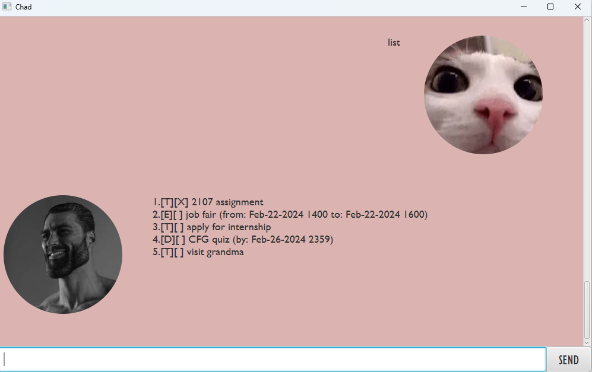

# Chad User Guide



Welcome to your very own ~~Chadbot~~ Chatbot named GigaChad! You can just call him Chad.
Chad will help you to **manage tasks** via a **Command Line Interface (CLI)** while still having
the benefits of a **Graphical User Interface (GUI)**. Todos, deadlines and events are all supported!

## Quick start

1. Ensure you have `Java 11` or above installed in your Computer.
2. Download the latest `Chad.jar` from [here](https://github.com/chonghaoen/ip/releases).
3. Copy the file to the folder you want to use as the home folder for Chad.
4. Open a command terminal, `cd` into the folder you put the jar file in, and use the `java -jar TodoPal.jar` command to run the application.
5. Type a command in the command box and press Enter to execute it!
6. Refer to the Features below for details of each command.

## Features
> [!NOTE]  
> Words in UPPER_CASE are the parameters to be supplied by the user.
> e.g. in `todo TASK_DESCRIPTION`, `TASK_DESCRIPTION` is a parameter which can be used as `todo eat dinner`.

### Adding deadlines

Adds a deadline to the task list.

Format `deadline TASK_DESCRIPTION /by YYYY-MM-DD HHmm`

Example: `deadline 1101 homework /by 2024-02-25 2359`

```
added:
[D][ ] 1101 homework (by: Feb-25-2024 2359)
There are 2 tasks in the list.
```

### Adding todos

Adds a todo to the task list.

Format `todo TASK_DESCRIPTION`

Example: `todo feed cat`

```
added:
[T][ ] feed cat
There are 3 tasks in the list.
```


### Adding events

Adds an event to the task list.

Format `event TASK_DESCRIPTION /from YYYY-MM-DD HHmm /to YYYY-MM-DD HHmm`

Example: `event job fair /from 2024-02-25 1400 /to 2024-02-25 1600`

```
added:
[E][ ] job fair (from: Feb-25-2024 1400 to: Feb-25-2024 1600)
There are 4 tasks in the list.
```

### Marking a task
Marks a task on the task list as done.

Format: `mark TASK_INDEX`

Example: `mark 2`

```
Setting task as done...
1.[T][ ] 2103
2.[D][X] 1101 homework (by: Feb-25-2024 2359)
3.[T][ ] feed cat
4.[E][ ] job fair (from: Feb-25-2024 1400 to: Feb-25-2024 1600)
```

### Unmarking a task
Marks a task on the task list as undone.

Format: `unmark TASK_INDEX`

Example: `unmark 2`

```
Setting task as not done...
1.[T][ ] 2103
2.[D][ ] 1101 homework (by: Feb-25-2024 2359)
3.[T][ ] feed cat
4.[E][ ] job fair (from: Feb-25-2024 1400 to: Feb-25-2024 1600)
```

### Deleting a task

Deletes the specified task on the to-do list.

Format: `delete TASK_INDEX`

Example: `delete 2`

```
Deleting task:
1.[T][ ] 2103
2.[T][ ] feed cat
3.[E][ ] job fair (from: Feb-25-2024 1400 to: Feb-25-2024 1600)
```

### Listing tasks
Lists all the current tasks in the task list.
Format: `list`
```
1.[T][ ] 2103
2.[T][ ] feed cat
3.[E][ ] job fair (from: Feb-25-2024 1400 to: Feb-25-2024 1600)
```

### Finding tasks

Finds a task in the task list containing a keyword.

Format: `find KEYWORD`

Example: `find cat`

```
Here are the tasks containing 'cat'.
1.[T][ ] feed cat
```

### Archiving task list
Archives the current task list into `data/archive.txt`.

Format: `archive`

```
Archiving current task list...
```

### Exiting program

Exits the program and allow Chad to go back to the gym.

Format: `bye`

```
Bye. Back to the gym.
```

### Storing Data
The task list is stored in `data/chad.txt` and is updated after every command.


